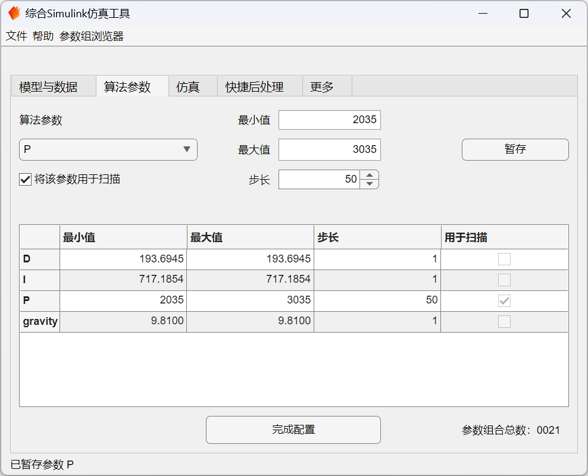

# SCT - 综合 Simulink 仿真配置工具

## 简介

SCT（SimConfigTool）是一个基于 MATLAB App 设计开发的辅助工具，用于配置运行 Simulink 模型仿真。以图形化方式集成选择模型、选择数据、参数扫描、调整仿真模式与停止时间、并行仿真、快捷后处理等仿真常用功能，无需修改模型文件即可满足大多数仿真需求。

## 模型要求

为将此 APP 应用于原有的 Simulink 模型，需要对模型进行几处微小的调整（或在建立新模型时遵守以下约定）：

1. 使用变量存储参数，变量名需要以特定前缀（`Param_`）开头。
2. 这些变量应存储于[模型工作区（Model Workspace）](https://ww2.mathworks.cn/help/simulink/ug/using-model-workspaces.html)中，变量值作为参数的默认值。
3. 输出模块（[Outport](https://ww2.mathworks.cn/help/simulink/slref/outport.html)）名称以（`ModelOutport`）起始，并设置有意义的信号名。

详见[*修改模型以适应综合仿真工具APP*](Docs/修改模型以适应综合仿真工具APP.md)

## 算法参数

在“算法参数”选项卡，用户可根据需要调整每一项参数的数值。亦可将某一项或某几项（最多不超过 5 项）参数设置为“用于参数扫描的参数”，在用户设置的范围内按指定步长变化，运行多组仿真，并可以比较这些不同参数组仿真结果的差异。

可以在「参数组浏览器」中查看当前设置的所有参数组。

> 推荐阅读：[优化、估计和扫描模块参数值](https://ww2.mathworks.cn/help/simulink/ug/optimize-estimate-and-sweep-block-parameter-values.html)

## 并行仿真

参数扫描仿真任务本质上是运行一组非常相似的仿真任务并比较其结果，非常适合使用[并行仿真](https://ww2.mathworks.cn/help/simulink/ug/running-parallel-simulations.html)来加快仿真速度。借助于 [Parallel Computing Toolbox](https://ww2.mathworks.cn/help/parallel-computing/index.html) 可以充分发挥所有 CPU 核心的性能（在核心数很多的工作站/服务器上效果尤佳），使用 MATLAB Parallel Server 则可以在计算机集群、云上进行更大规模的并行仿真。

对于较多的参数组合，使用并行仿真可以显著缩短耗时，但也会使用更多内存，并且启动速度较慢。当仿真数量较少、运行耗时很短或内存不足时，建议使用串行仿真。并行仿真需要有 Parallel Computing Toolbox 工具箱支持才可用，否则将退化为串行仿真。

相关文档：

- [运行并行仿真](https://ww2.mathworks.cn/help/simulink/ug/running-parallel-simulations.html)
- [parsim - 以并行或串行方式进行多次动态系统仿真](https://ww2.mathworks.cn/help/simulink/slref/parsim.html)
- [使用 Parsim 进行并行仿真：普通模式下的参数扫描](https://ww2.mathworks.cn/help/simulink/slref/parallel-simulations-using-parsim-parameter-sweep-in-normal-mode.html)
- [使用 Parsim 进行并行仿真：快速加速模式下的参数扫描](https://ww2.mathworks.cn/help/simulink/slref/parallel-simulations-using-parsim-parameter-sweep-in-rapid-accelerator-mode.html)
